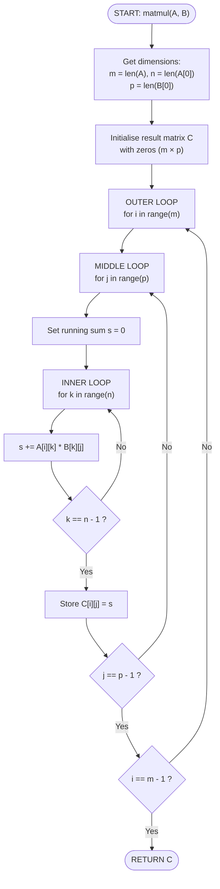

# Matrix Multiplication Flowchart — `matmul(A, B)`

Algorithm: multiply `A` (m×n) by `B` (n×p) → result `C` (m×p).



## Legend

| Symbol | Meaning |
|---|---|
| `[ ... ]` | Process step |
| `{ ... }` | Decision / condition |
| `([ ... ])` | Start / End (stadium shape) |
| `-->` | Flow direction |

## Complexity

- **Time**: O(m × n × p) — triple nested loops
- **Space**: O(m × p) — for the result matrix `C`

## How to render this chart

### In Google Colab:

```python
!pip install colab-print
import colab_print
colab_print.print_mermaid("""
flowchart TD
    START(["START: matmul(A, B)"]) --> DIMS["Get dimensions: ..."]
    ...
""")
```

### In VS Code:

Install the **Markdown Preview Mermaid Support** extension, then open this
file and press `Ctrl+Shift+V`.

### Online:

Copy the Mermaid block (between the triple backticks) into
[mermaid.live](https://mermaid.live/).
